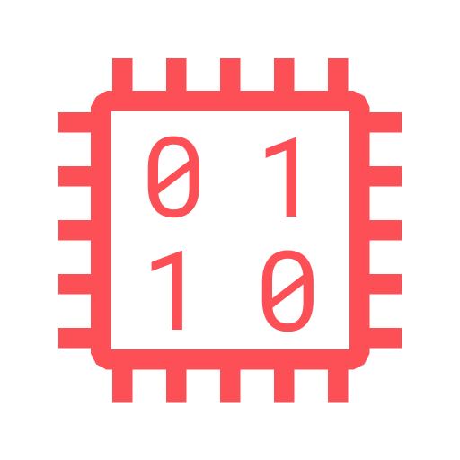

<br />
<p align="center">
  <a href="https://github.com/vexelabs/bitbuilder">
    
  </a>

  <h3 align="center">Bitbuilder</h3>

  <p align="center">
    The missing bridge between Kotlin/JVM and LLVM
    <br />
    <a href="https://vexelabs.io/projects/bitbuilder">
        <strong>Read the docs»</strong>
    </a>
    <br />
    <br />
    <a href="https://github.com/vexelabs/bitbuilder/issues">Report Bug</a>
    ·
    <a href="https://github.com/vexelabs/bitbuilder/issues">Request Feature</a>
  </p>
</p>

**Note: Bitbuilder is still in development, this document may contain dead
links. There is no published documentation for the project yet.** 

There were no good options for using LLVM on the JVM. Bitbuilder is a modern
library for interacting with LLVM's C API, written in idiomatic Kotlin.

Bitbuilder uses [javacpp-presets/llvm][llvm-presets] via JNI to access the
LLVM-C APIs.

## Table of Contents

- [Getting Started](#getting-started)
  - [Prerequisites](#prerequisites)
  - [Installation](#installation)
- [Usage](#usage)
- [Roadmap](#roadmap)
- [Contributing](#contributing)
- [License](#license)
- [Contact](#contact)

## Getting Started

### Prerequisites

Bitbuilder runs on the JVM, so a Java 8+ installation must be present on the
user's machine.

We will be fetching the artifacts from Jitpack so Gradle, or another build
tool of your choice is necessary as well.

You do not have to have a LLVM installation on your machine. The 
[javacpp-presets][llvm-presets] come with prebuilt binaries. If you do not
want to use these binaries, there is an instruction for using self-compiled
binaries in the [documentation](https://vexelabs.io/projects/bitbuilder).

### Installation

This example will use Gradle as its build system, but the process is similar
for other build systems as well.

1. Add the Vexelabs Repository

> Bitbuilder is not ready for release, the builds are all in the snapshot repo

```kotlin
repositories {
    maven("https://repo.vexelabs.io/snapshots")
}
```

2. Add the Bitbuilder dependency

> Bitbuilder is not ready for release, the only available artifacts are snapshot
> artifacts.

```kotlin
dependencies {
    implementation("io.vexelabs:bitbuilder:0.1.0-SNAPSHOT")
}
```

## Usage

Because we are yet to release an initial release of Bitbuilder we do not plan
on offering support for the project as of right now. A lot of the APIs in the
project are subject to change.

You may find sample projects in the [samples](samples) folder. The Kotlin
autogenerated documentation can be found at [apidocs.vexelabs.io][apidocs].

## License

This project is licensed under the Apache 2.0 License. See `LICENSE` for more
information.

## Contact

- [@supergrecko](https://twitter.com/supergrecko) - me@supergrecko.com

GitHub Repository Link: [https://github.com/vexelabs/bitbuilder][repo-url]

[repo-url]: https://github.com/vexelabs/bitbuilder
[llvm-presets]: https://github.com/bytedeco/javacpp-presets/tree/master/llvm
[apidocs]: https://apidocs.vexelabs.io/bitbuilder/index.html